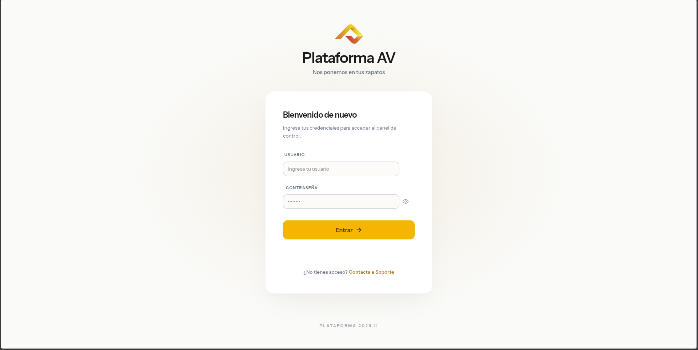
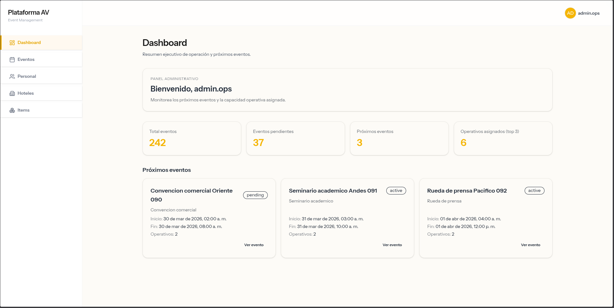
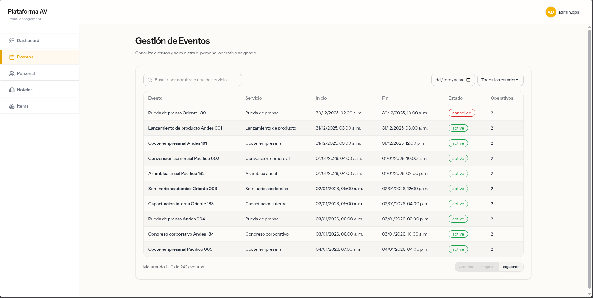

# Plataforma AV - Simulación de gestión de pedidos

Este proyecto simula un problema real que puede tener una empresa como Plataforma AV cuando gestiona muchos pedidos de eventos.  
El flujo principal es: los hoteles crean pedidos y luego el equipo administrativo asigna el personal operativo para atender cada evento.

La meta fue construir una base de software clara y mantenible para controlar ese proceso, reducir errores de coordinación y evitar conflictos de agenda de operativos.

## Qué decidí construir

Decidí modelar dos procesos clave del negocio:

1. Creación y gestión de pedidos por parte de hoteles.
2. Asignación de personal operativo por parte de administradores.

También se incluyó la validación de reglas importantes, por ejemplo: un operativo no puede estar asignado a dos eventos al mismo tiempo.

## Cómo lo construí

Para hacerlo seguí un proceso por etapas.  
Primero hice el análisis de la empresa, luego defini un posible error que podría tener la empresa, realice el analisis del problema y de los flujos de negocio.  
Después realicé el modelado de datos para definir entidades, relaciones y reglas.  
Luego definí la arquitectura técnica y, con esa base, empecé la codificación.

## Arquitectura y calidad técnica

Se utilizó una arquitectura por capas para separar responsabilidades y facilitar el mantenimiento.  
Algunas decisiones relevantes:

- Validaciones centralizadas para evitar inconsistencias
- Control de acceso por roles para proteger operaciones críticas
- Logging y trazabilidad para facilitar debugging y monitoreo
- Optimización en base de datos enfocada en consultas frecuentes (asignaciones y disponibilidad)

Esto nos permite que el sistema pueda crecer facilmente.

## Frontend reutilizable

Del lado del frontend se usó Atomic Design para construir componentes reutilizables. 

Esto permite:
- Mantener consistencia visual
- Reducir duplicación
- Facilitar cambios sin romper la UI

## Imagenes del proyecto

  

  

  

## Docker y compatibilidad entre entornos

Se utilizó Docker porque trabajo en Linux y quería asegurar compatibilidad del software en diferentes entornos de desarrollo y despliegue.  
Con contenedores, cualquier persona del equipo puede levantar el proyecto con una configuración estándar y menos problemas de dependencias.

## Instalacion 

Para instalar el proyecto sigue los pasos de instalacion de este archivo:

- [docs/INSTALACION.md](docs/INSTALACION.md)

## Pruebas automatizadas en sandbox

Para ejecutar pruebas automatizadas en un entorno sandbox (aislado), revisa esta guía:

- [docs/PRUEBAS_AUTOMATIZADAS_SANDBOX.md](docs/PRUEBAS_AUTOMATIZADAS_SANDBOX.md)
